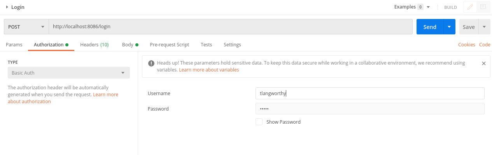

# To Do App with time zones
### Why did you make this?
Since I've never worked with time zones in Java, I decided to make a simple application 
that stores all timestamps in a database in UTC, then converts them to and from local time zones. 
This also uses Spring Security to authenticate users to demonstrate users in various time zones.
This is a simple REST API "To Do App" that stores and displays todo items.

### REST API
### Create a new user and time zone setting
**POST** `http://localhost:8086/register`
#### Example Request
    {
        "username": "tlangworthy",
        "name": "Tony Langworthy",
        "password": "12345",
        "userSettings": [
            {
                "name": "time_zone",
                "settingValue": "America/Chicago"
            }
        ]
    }

### Login
**POST** `http://localhost:8086/login`

This app uses Basic HTTP authentication, and login is easy with Postman. Just click the 
authorization tab, choose Basic Auth, fill in your credentials you created when you "Registered",
then just hit send. The Spring Boot application will send a cookie that Postman can use 
for all other requests. 

### Create ToDo Item
**POST** `http://localhost:8086/todo-list
#### Example Request
    {
        "name": "Understand timezones in Java",
        "isCompleted": false,
        "startedAt": "03/13/2021 01:20 PM"
    }
#### Example Response
    {
        "id": 14,
        "name": "Understand timezones in Java",
        "startedAt": "2021-03-13T13:20:00-06:00",
        "endedAt": null,
        "createdAt": "2021-05-01T22:24:32.626800Z",
        "updatedAt": null,
        "completed": false
    }
***
### List All ToDo Items
**GET** `http://localhost:8086/todo-list
#### Example Response 
    [
        {
            "id": 1,
            "name": "Understand timezones in Java",
            "startedAt": "03/13/2021 01:20 PM",
            "endedAt": null,
            "completed": false
        }
    ]

Note: This is not an example of a well-designed application. I have stuff most of the 
logic in the controller instead of creating service classes. This is simply an 
example of time zone conversion.
